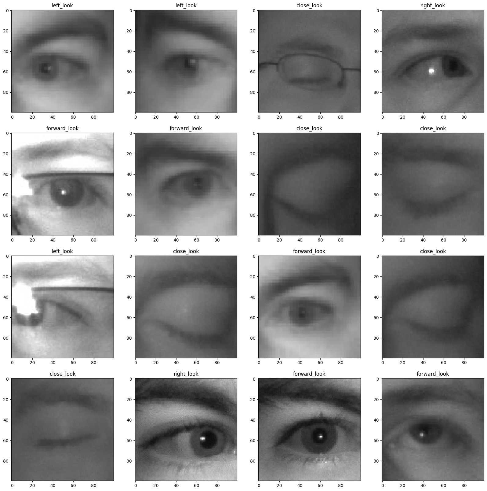

# Eye Direction

This project involves using a deep convolutional network to predict where the eyes are gazing.

- **Activation Function**: The SELU (Scaled Exponential Linear Unit) activation works significantly better than other activation functions in this context.

- **Hidden Layers**: Interestingly, adding more hidden layers did not lead to better generalization of the model.

The model achieves over 90% accuracy on the validation set.

## Images from Dataset

